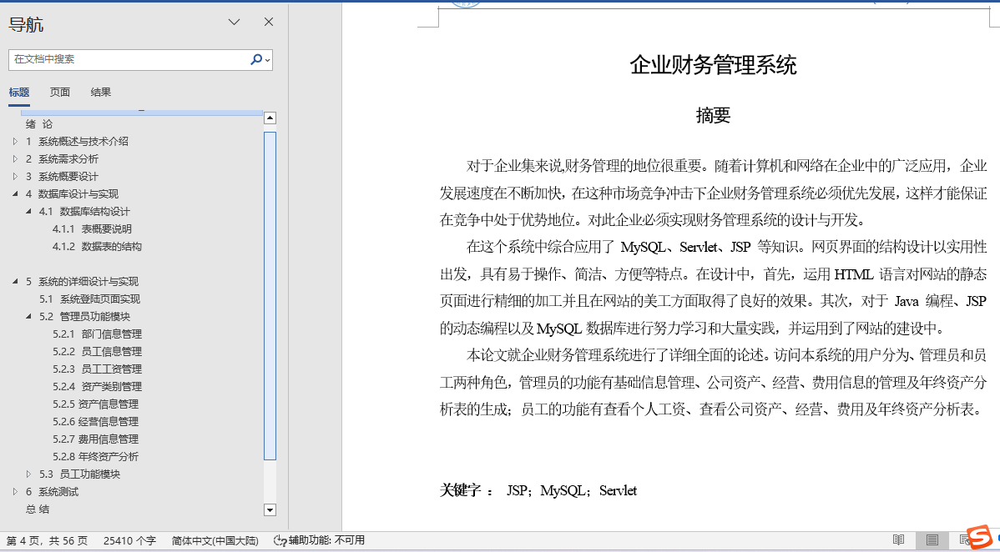
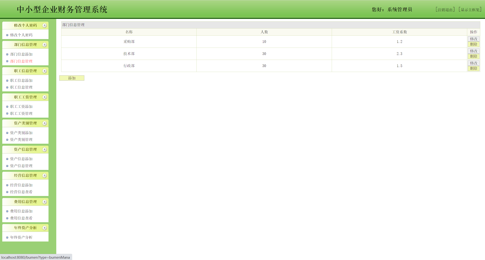
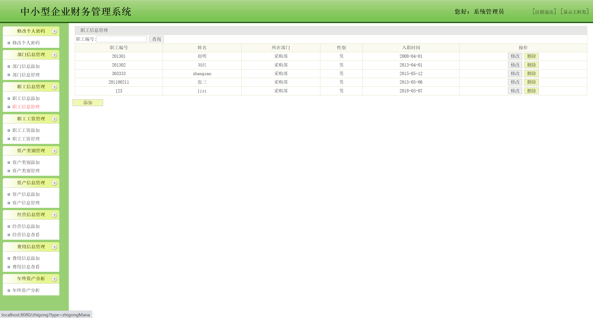
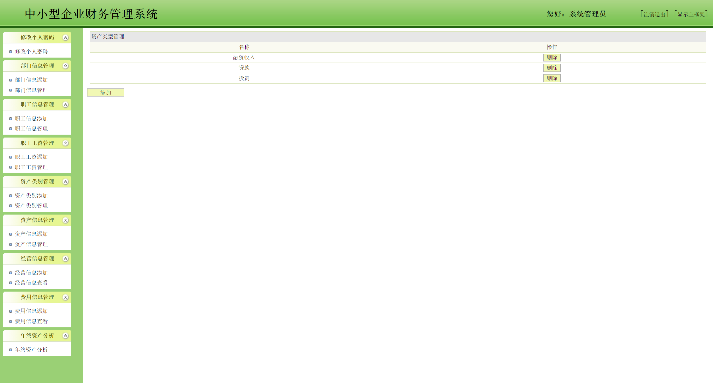
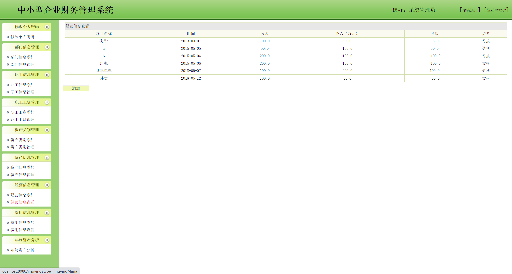
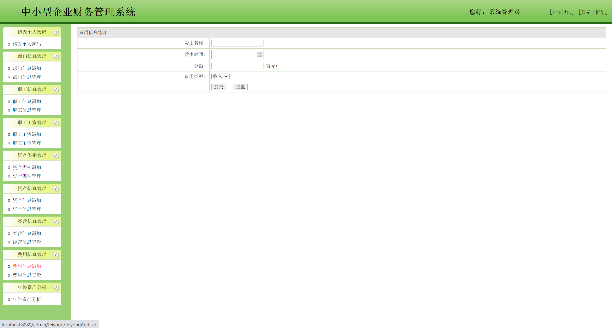
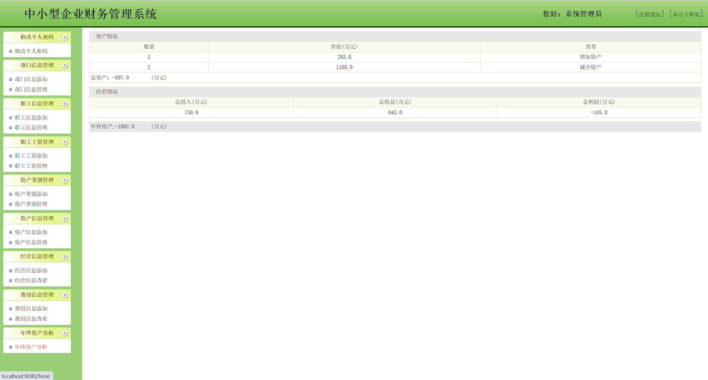
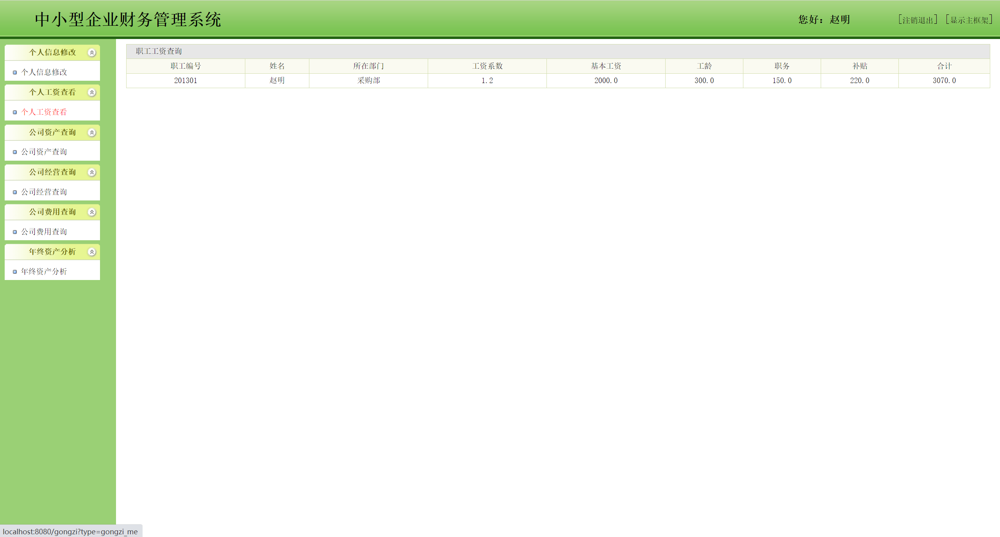

## 基于JSP+Servlet实现的企业财务管理系统(程序+报告)

- <b>完整代码获取地址：从戎源码网 ([https://armycodes.com/](https://armycodes.com/))</b>
- <b>技术探讨、资料分享，请加QQ群：692619798</b> 
- <b>作者微信：19941326836  QQ：952045282</b> 
- <b>承接计算机毕业设计、Java毕业设计、Python毕业设计、深度学习、机器学习</b>
- <b>选题+开题报告+任务书+程序定制+安装调试+论文+答辩ppt 一条龙服务</b>
- <b>所有选题地址 ([https://github.com/YuLin-Coder/AllProjectCatalog](https://github.com/YuLin-Coder/AllProjectCatalog)) </b>

## 项目介绍
基于JSP+Servlet实现的企业财务管理系统，有职工和管理员两个角色，主要功能如下

【职工】
个人工资查看、公司资产查询、公司经营查询、年终资产分析

【管理员】
修改个人密码：修改个人密码
部门信息管理：部门信息添加，部门信息管理
职工信息管理：职工信息添加，职工信息管理
职工工资管理：职工工资添加，职工工资管理
资产类别管理：资产类别添加，资产类别管理
资产信息管理：资产信息添加，资产信息管理
经营信息管理：经营信息添加

## 项目技术
- 编程语言：Java
- 数据库：MySQL
- 前端技术：JSP、JavaScript、bootstrap、JQuery
- 后端技术：Servlet、JDBC

## 运行环境
- JDK版本：JDK1.8及以上
- 开发工具：IDEA、Ecplise、Myecplise都可以
- 数据库: MySQL5.7及以上

## 运行截图

